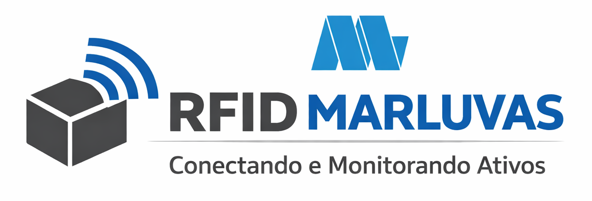
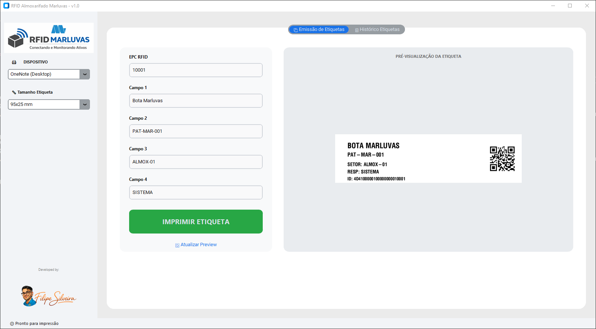

# RFID Almoxarifado Marluvas v2.0 🚀

Sistema para geração, codificação e impressão de etiquetas RFID em conformidade com padrões industriais de rastreabilidade.

## ✨ Funcionalidades
- **Codificação Inteligente:** Gera EPCs de 24 caracteres (96 bits) com prefixo de segurança Marluvas.
- **Dual Layout:** Suporte automático para etiquetas 95x25mm e 100x50mm.
- **Histórico Local:** Banco de dados SQLite integrado para auditoria de impressões.
- **Preview em Tempo Real:** Visualização da etiqueta via API Labelary antes da impressão física.
- **Build Profissional:** Executável otimizado com metadados de versão e direitos autorais.

## 🛠️ Tecnologias Utilizadas
- **Linguagem:** Python 3.14
- **Interface:** CustomTkinter (Visual Moderno/Dark Mode support)
- **Banco de Dados:** SQLite3
- **Comunicação de Impressão:** Win32Print (Protocolo RAW para Zebra/Argox)

## 📸 Interface do Software

---
Desenvolvido by: 

